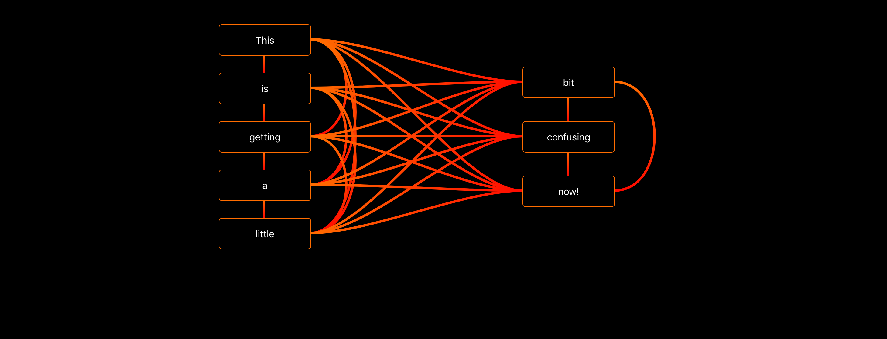
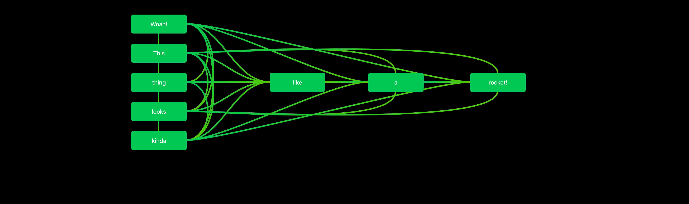

# Quantify
A developer-friendly library for creating flowcharts and diagrams.

Simple demo [here](https://mariusbrataas.github.io/flowpoints.js/?p=simpledemo) and cooler demo [here](https://mariusbrataas.github.io/flowpoints.js/?p=demo), both running the same source code [here](https://github.com/mariusbrataas/flowpoints/tree/master/demo/src)

Or check out [this](https://mariusbrataas.github.io/flowpoints.js/?p=j1t11ab05d3liaj) or [this](https://mariusbrataas.github.io/flowpoints.js/?p=j1t1qchh2nfqgoj) or [this](https://mariusbrataas.github.io/flowpoints.js/?p=j1t1161m2tjbuou)

